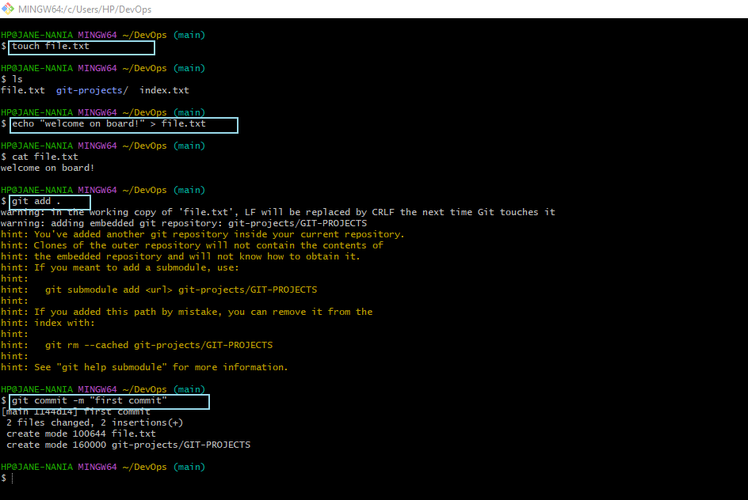

## GIT-PROJECTS

`Git` is a distributed version control system designed to track changes in source code during software development. It provides a way for multiple developers to collaborate on a project by managing and recording changes to the codebase. Key concepts of Git include:

`Repository (Repo):` A repository is a storage space where your project's history and files are kept. It can be local (on your computer) or remote (on a server).

`Commit:` A commit is a snapshot of the project at a specific point in time. Each commit records changes to the code, and developers add comments to describe the changes.

`Branch:` Git allows developers to create separate branches to work on specific features or fixes without affecting the main codebase. Branches can later be merged back into the main branch.

`Merge:` Merging is the process of combining changes from different branches into a single branch. This is often done when a feature is complete and ready to be added to the main codebase.

`Pull Request (PR):` In collaborative environments, developers often use pull requests to propose changes to the main branch. A pull request is a request to merge changes from one branch into another, allowing for code review and discussion before merging.

`Clone:` Cloning is the process of copying a repository from a remote server to your local machine. This allows you to work on the project locally and contribute changes back to the repository.

`Push:` Pushing is the act of sending your committed changes to a remote repository. This makes your changes available to others and keeps the remote repository up-to-date.

`Pull:` Pulling is the process of fetching changes from a remote repository and merging them into your local repository. This ensures your local copy is in sync with the latest changes from the remote.

`Git` is widely used in software development because it enables collaboration, provides a detailed history of changes, and allows developers to work on different aspects of a project simultaneously. It's a fundamental tool for version control and is a key component of many DevOps workflows.

### INITIALIZING GIT

I initialized git by running the commands `mkdir`, `cd` and `git init`.

### COMMITTING IN GIT
Below are the commands used for the first commit.
`touch, echo, git add . and git commits.`

### MAKING A NEW BRANCH

I created a new branch called `my-new-branch` by running the command `git checkout -b my-new-branch`. this command also automatically switches me to that new branch from the default branch `main`.

### BRANCH LISTING

To confirm the number of branches i have or know the current branch i'm in, i run the command `git branch`.

### BRANCH SWITCHING

To switch into another branch, i ran the command `git switch (BranchName)` or `git checkout BranchName`. That is, `git switch main`. 

### MERGING BRANCHES

Merging branches is used to add the content of one branch inside another.
I acheived that using the following steps...

1. I replaced the former text in my `file.txt` file using the `echo command`.
2. I confirmed this worked by running the `cat command`.
3. I appended a text also to the `file.txt` file and confirmed it also , using the `cat command`.
4. I Cconfirmed the present branch and staged my files by running the commands `git status` and `git add .` respectively.
5. I committed the files and switched branch from `my-new-branch` to `main` branch by running the commands `"git commit` and `git checkout main`" respectively.
6. I merged the `my-new-branch` into the `main` branch by running the command `"git merge"`.

